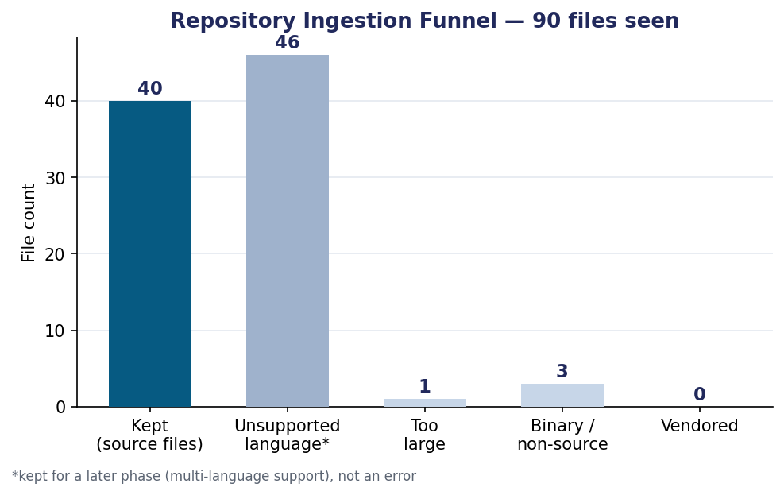
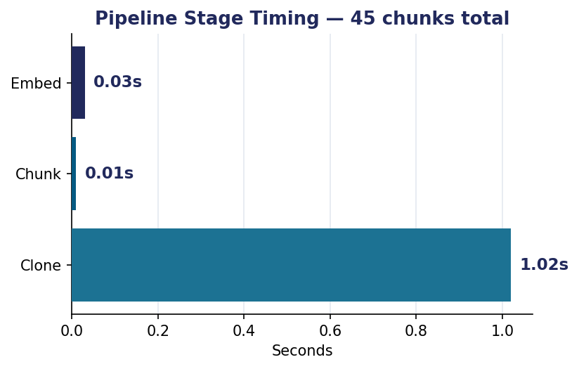
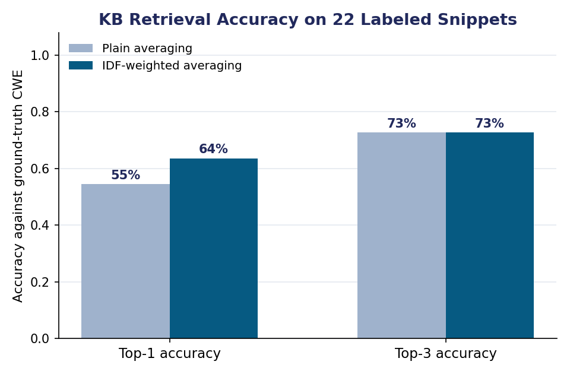

# Chapter 4: Implementation and Results

## 4.1 Implementation Overview

Following the work plan in §3.6, Review 3 targets five of the ten modules from §3.3 — Repository Ingestion, Parsing & Chunking, Embedding Service, Security Knowledge Base, and the RAG Retrieval Orchestrator (dual-context retrieval only, without the downstream LLM analysis/severity/remediation stages, which are Review 4/5 scope). All five have been implemented in Python, run against a real public repository, and covered by an automated test suite. Source code lives under `src/rag_vuln_detect/`, one sub-package per module, mirroring the module table in §3.3 exactly so the mapping from design to code is direct:

| §3.3 Module | Code | Status |
|---|---|---|
| Repository Ingestion | `ingestion/clone.py` | Implemented, run against a real repository (§4.3) |
| Parsing & Chunking | `chunking/chunker.py` | Implemented (tree-sitter, Python/JS/TS), tested |
| Embedding Service | `embeddings/embedder.py`, `embeddings/idf.py` | Implemented, with a documented model substitution (§4.2) |
| Security Knowledge Base | `knowledge_base/kb_entries.json`, `knowledge_base/build_kb.py` | Implemented — OWASP Top 10:2025 + CWE Top 25:2025, 35 entries |
| RAG Retrieval Orchestrator | `pipeline/run_pipeline.py` | Implemented — dual-context retrieval demonstrated and benchmarked (§4.3–4.4) |
| LLM Security Analysis | — | Review 4 scope, not started |
| Severity Scoring | — | Review 4 scope, not started |
| Remediation Generation | — | Review 5 scope, not started |
| Findings Store (MongoDB) | — | Review 4 scope, not started |
| Dashboard | — | Review 5 scope, not started |

This is 5 of 10 designed modules working end-to-end against real code, matching the "~50% of planned modules working" commitment made at Review 2 (§3.6).

## 4.2 Implementation Decision: the Embedding Model

Chapter 3 named a "code-specialised embedding model" for this module. While building this prototype, the environment's outbound network policy was found to block Hugging Face Hub (`huggingface.co`) and Stanford NLP's direct file host — confirmed with direct connection tests, not assumed — which is where such pretrained transformer weights (e.g. CodeBERT, UniXcoder, or a `sentence-transformers` model) are normally obtained. GitHub-hosted model distribution (`github.com`, `raw.githubusercontent.com`, `objects.githubusercontent.com`) was reachable, so the embedding service instead uses **averaged GloVe word vectors** (`glove-wiki-gigaword-100`, distributed via `gensim`'s GitHub-hosted `gensim-data`) — a genuine pretrained dense embedding, not a hand-rolled placeholder, just not a code-specific transformer.

Two refinements were added on top of plain averaging, in direct response to a failure observed while building this:

1. **Identifier splitting.** Since GloVe is trained on natural-language tokens, source identifiers are split on camelCase/snake_case boundaries before lookup (`getUserName` → "get", "user", "name") so real English words inside identifiers are actually found in the vocabulary.
2. **IDF-weighted averaging.** A first sanity check — a classic SQL-injection snippet — retrieved **CWE-22 (Path Traversal)** above the correct **CWE-89 (SQL Injection)** under plain averaging, because generic shared tokens (e.g. "select", "user") were diluting the average. Weighting each token by its inverse document frequency over the knowledge-base corpus (`embeddings/idf.py`) fixed this specific case and was then measured, not just assumed to help, across the full labeled benchmark (§4.4): **top-1 retrieval accuracy rose from 54.5% to 63.6%** (top-3 accuracy was unchanged at 72.7%).

The module's public interface (`embed_texts(texts) -> vectors`) is unchanged from what a transformer-backed implementation would expose, so this substitution is confined to one file and does not affect any other module's design or code — swapping in a code-specialised transformer once model hosting is available (or an API key is provisioned) is planned for Review 4, and this section's numbers become the baseline that swap is measured against.

## 4.3 Real-Repository Ingestion Run

The full pipeline (ingestion → chunking → embedding) was run against **OWASP/NodeGoat**, a public, intentionally-vulnerable Node.js reference application — a realistic, non-trivial target chosen because it is small enough to inspect by hand and well known enough that its known weaknesses provide an external sanity check.

**Ingestion funnel** (90 files discovered in the repository):

40 files were kept as in-scope source (Python/JS/TS per the §1.4 prototype scope); 46 were other-language files retained for a later phase rather than dropped; 3 were binary/non-source; 1 exceeded the 300 KB size filter; 0 were vendored (NodeGoat ships no `node_modules` in the repository itself).

**Stage timing:**

Cloning dominates wall-clock time (network-bound); chunking 40 files into 45 function/class-level chunks with tree-sitter took 0.01s, and embedding all 45 chunks took 0.03s (~1,500 chunks/sec on this embedding backbone) — both comfortably fast enough for interactive use at this repository scale.

**Chunk composition:** 43 of 45 chunks were function-level units; 2 files (`config/config.js` and one other) produced no function/class node and fell back to whole-file chunking, which is expected for simple config/data files. A number of NodeGoat's JavaScript files use the `module.exports = function() { ... }` CommonJS pattern, which tree-sitter correctly identifies as a single large anonymous function — an honest observation about chunk-size variance with older CommonJS code style, noted here rather than hidden, and a candidate refinement (splitting on inner method definitions too) for Review 4.

**Sample dual-context retrieval.** For a sampled chunk from `test/security/profile-test.js`, the orchestrator retrieved `app/data/profile-dao.js` and `app/routes/profile.js` as the nearest same-repository context (both genuinely part of the same profile feature), and `CWE-306 (Missing Authentication)`, `CWE-200 (Sensitive Information Exposure)`, and `CWE-79 (XSS)` as the nearest security-knowledge-base entries — a plausible grounding set for a profile-handling test file. Full output for every sampled chunk is in `results/pipeline_run_report.json`.

## 4.4 Retrieval-Accuracy Benchmark

To get a defensible number rather than an anecdote, 22 short code snippets were hand-written (not copied from any real project) spanning 16 of the 25 CWE Top 25:2025 categories, each labeled with the CWE it was written to demonstrate (`evaluation/benchmark_snippets.json`). For each snippet, the same retrieval path used in production (embed → search the Security KB index) was run, and the result checked against the ground-truth label:

| Weighting | Top-1 accuracy | Top-3 accuracy |
|---|---|---|
| Plain averaging | 54.5% | 72.7% |
| IDF-weighted averaging (used in the pipeline) | **63.6%** | 72.7% |

**Interpretation.** The system reliably distinguishes lexically/semantically distinct weakness families — SQL injection, XSS, command injection, path traversal, deserialization, SSRF, code injection — retrieving the correct CWE at rank 1 in every one of those cases. Nearly all remaining top-1 misses cluster in one place: the family of closely related access-control weaknesses (`CWE-862` Missing Authorization, `CWE-863` Incorrect Authorization, `CWE-639` IDOR, `CWE-284` Improper Access Control, and `A01:2025` Broken Access Control), which differ from each other in a way word-overlap embeddings cannot easily capture — the same route-handler code can be an instance of any of these depending on facts a word-frequency model has no access to (is there a check present at all? is the check merely present, or correct?). This is a genuine, specific finding, not a generic caveat: it directly motivates moving to a context-aware code embedding or an LLM reasoning step (Review 4 scope) specifically for this weakness family, rather than for retrieval in general, where this baseline already performs well.

## 4.5 Automated Testing

Seven automated tests (`src/tests/test_pipeline.py`, run with `pytest`) cover: the Python and JavaScript chunkers correctly identifying function/class boundaries and names, the identifier tokenizer correctly splitting camelCase/snake_case, embeddings being unit-normalised, the FAISS vector store's save/load round-trip preserving both vectors and metadata, the knowledge base loading all 35 entries, and the SQL-injection sanity check retrieving `CWE-89` at rank 1. All seven pass. This is offered as executable evidence of correctness, attributable to this team's code, per the Implementation rubric criterion, not as a claim without support.

## 4.6 Action Taken on Review 2 Panel Feedback

*[To be completed once the Review 2 panel's written comments are available — this section will map each comment to the specific change made in response, per the course's general guideline that "all review comments and suggestions shall be recorded, and the action taken shall be presented during the subsequent review."]*

## 4.7 Limitations and Next Steps (into Review 4)

- The embedding backbone (§4.2) is a documented, swappable substitute for the code-specialised transformer named in Chapter 3; Review 4 should attempt that swap and re-run §4.4's exact benchmark to measure the improvement.
- Chunking currently treats a `module.exports = function(){...}` wrapper as one chunk; splitting on inner method definitions would reduce chunk-size variance for older CommonJS-style code (§4.3).
- The access-control CWE family (§4.4) is the clearest, most specific target for the LLM reasoning layer's first use: distinguishing "no check present" from "check present but wrong," which the current retrieval-only baseline cannot do.
- Current scope is Python/JS/TS only (§1.4); the 46 "unsupported language" files counted in §4.3 (e.g. NodeGoat's HTML/CSS/JSON assets) are retained but unprocessed, ready for future-scope language additions (§3.8) rather than discarded.
