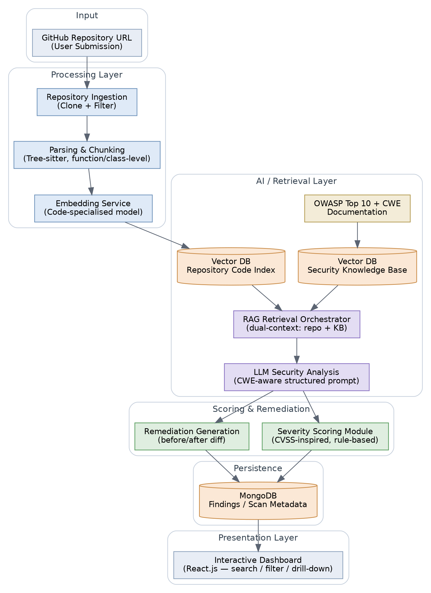

\newpage

# VIT CHENNAI

### School of Computer Science and Engineering (SCOPE)

### BCSE497J — Project – I

### Fall Semester 2026–2027

  

## AI-Powered Secure Code Analysis and Vulnerability Detection using Retrieval-Augmented Generation (RAG)

**Review 3 (Panel) — Supporting Report: Chapters 1–4**

  

**Submitted by:**

Aakash Sivakumar — 23BCE5119

Udhay Anand Pandiyan — 23BCE1793

**Programme:** B.Tech. Computer Science and Engineering

**Guide:** Jenila Livingston L M

**Review Date:** 16 September 2026

\newpage

## Abstract

As software applications grow in complexity, ensuring code security has become a critical challenge. Traditional static analysis tools frequently generate high volumes of false positives and offer limited, template-based explanations, making it difficult for developers to prioritise and fix real vulnerabilities. This project proposes a web-based application that automatically analyses public GitHub repositories for security vulnerabilities using Retrieval-Augmented Generation (RAG). Source code is cloned, parsed, and chunked at function/class granularity, then embedded into a vector database. A separate, external knowledge base built from OWASP Top 10 and Common Weakness Enumeration (CWE) documentation is embedded into a second vector store. For each code chunk, the system retrieves both intra-repository context and relevant security-standards knowledge, and supplies both to a Large Language Model (LLM) for structured, CWE-aware vulnerability analysis. A custom, CVSS-inspired rule-based module assigns severity, and the LLM further proposes remediation with a before/after code comparison, all surfaced through an interactive dashboard. A review of twenty recent (2024–2026) papers on LLM/RAG-based vulnerability detection, false-positive reduction, automated severity scoring, and automated repair is used to justify the proposed architecture and to position it against the current state of the art.

Since Review 2, five of the ten designed modules — repository ingestion, parsing and chunking, the embedding service, the OWASP/CWE security knowledge base, and dual-context RAG retrieval — have been implemented in Python and run end-to-end against a real public repository, with results measured on a 22-snippet labeled benchmark (63.6% top-1 / 72.7% top-3 retrieval accuracy against ground-truth CWE labels) and verified by seven automated tests. This report presents the domain background and problem statement (Chapter 1), the literature review (Chapter 2), the proposed methodology and system design (Chapter 3), and the Review 3 implementation and results (Chapter 4).

\newpage

## Table of Contents

1. Introduction .......................................................... 1
   1.1 Background and Motivation
   1.2 Problem Statement
   1.3 Project Objectives
   1.4 Scope
   1.5 Expected Outcomes
   1.6 Organisation of the Report
2. Literature Review ..................................................... 3
   2.1 Approach to the Review
   2.2 LLM- and RAG-Based Vulnerability Detection
   2.3 Reducing False Positives via LLM–Static-Analysis Integration
   2.4 Automated Severity / CVSS Scoring
   2.5 Automated Repair and Secure Code Generation
   2.6 Benchmarks and Evaluation Resources
   2.7 Comparative Summary
   2.8 References (Chapter 2)
3. Proposed Methodology and System Design .............................. 8
   3.1 Proposed Methodology
   3.2 System Architecture
   3.3 Module Description
   3.4 Technology Stack
   3.5 Feasibility, Risks, and Ethics
   3.6 Work Plan
   3.7 Innovation
   3.8 Future Scope
4. Implementation and Results ............................................ 12
   4.1 Implementation Overview
   4.2 Implementation Decision: the Embedding Model
   4.3 Real-Repository Ingestion Run
   4.4 Retrieval-Accuracy Benchmark
   4.5 Automated Testing
   4.6 Action Taken on Review 2 Panel Feedback
   4.7 Limitations and Next Steps

*(Page numbers are approximate and will auto-adjust once opened in Word — use Word's "Update Field"/regenerate Table of Contents if you convert this into a live TOC.)*

\newpage

INSERT_CHAPTER_1

\newpage

INSERT_CHAPTER_2

\newpage

INSERT_CHAPTER_3

\newpage

INSERT_CHAPTER_4

\newpage

## Appendix A: System Architecture Diagram

*Figure A.1 — End-to-end architecture: ingestion, dual-context RAG retrieval (repository code index + OWASP/CWE knowledge base), LLM-based analysis, rule-based severity scoring, remediation generation, and dashboard presentation.*

\newpage

## References (Standards and Foundational Sources)

1. OWASP Foundation, "OWASP Top 10:2025," [top10.owasp.org/2025](https://top10.owasp.org/2025/) — accessed 2026-09-14; the version implemented in the Security Knowledge Base (Chapter 4).
2. MITRE Corporation, "2025 CWE Top 25 Most Dangerous Software Weaknesses," [cwe.mitre.org/top25/archive/2025](https://cwe.mitre.org/top25/archive/2025/2025_cwe_top25.html) — accessed 2026-09-14; the version implemented in the Security Knowledge Base (Chapter 4).
3. FIRST.org, "Common Vulnerability Scoring System (CVSS)," [first.org/cvss](https://www.first.org/cvss/).
4. National Institute of Standards and Technology, "National Vulnerability Database (NVD)," [nvd.nist.gov](https://nvd.nist.gov/).
5. Pennington, R. et al., "GloVe: Global Vectors for Word Representation" (pretrained `glove-wiki-gigaword-100`, distributed via `gensim`'s `gensim-data`), used as the Review 3 embedding backbone — see Chapter 4, Section 4.2 for why and with what measured effect.

*(See Chapter 2, Section 2.8 for the full list of 20 literature references reviewed for this project.)*
